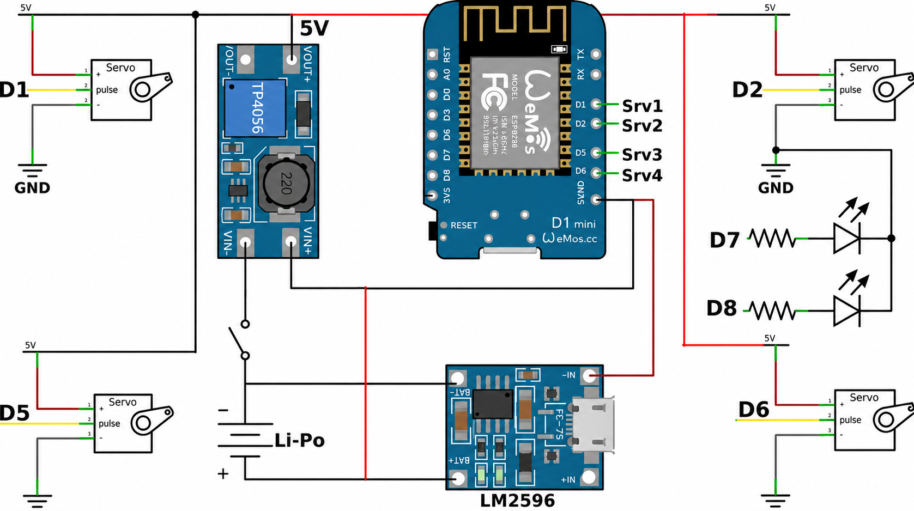
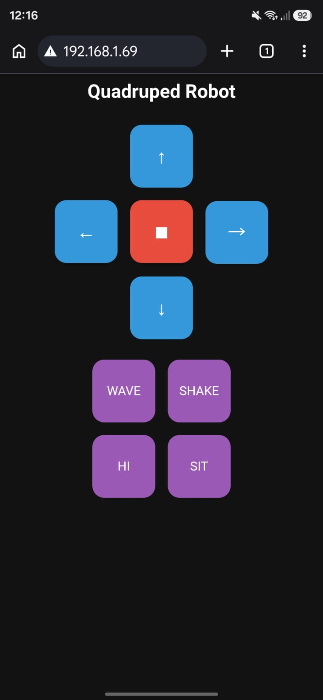

<div align="center">
  <h1>🤖 Quaddle</h1>
  <p><strong>The World’s Simplest Quadruped Robot</strong></p>
  
  <p>
    
    
    
  </p>
</div>

<br />

> **Quaddle** is a beginner-friendly, Wi-Fi-controlled quadruped robot powered by the ESP8266 / ESP32 . Designed to be the "world's simplest" robot dog, it utilizes a 1-DOF (Degree of Freedom) design per leg, eliminating the need for complex inverse kinematics or heavy mathematics. The robot hosts its own web interface, allowing you to control it directly from a browser without installing any apps.

---

## 🌟 Features

- **Simple Hardware:** Uses only 4 servos and common, cheap components.
- **Wi-Fi Control:** Controlled via a mobile-friendly web interface hosted on the ESP8266 / ESP32.
- **No App Required:** Works on any device with a modern web browser.
- **Easy Assembly:** Fully 3D printed with a snap-in design for servos.

---

## 📦 Bill of Materials (BOM)

| Component | Description / Specification |
| :--- | :--- |
| **Microcontroller** | Node MCU (ESP8266) / ESP32 |
| **Actuators** | 4x SG90 Micro Servos |
| **Power** | 3.7V LiPo Battery |
| **Charging** | TP4056 Charging Module (with battery protection) |
| **Voltage Regulation** | 5V Step-Up (Boost) Converter |
| **Capacitor** | 1500µF (placed on servo power line to handle startup current) |
| **Switch** | Slide switch (SPDT) |

---

## 🔌 Circuit & Wiring

Here is the wiring diagram to help you connect all the components correctly:

<div align="center">
  
</div>

### Pin Connections

| Servo | Node MCU Pin |
| :--- | :--- |
| **Servo 1** | D1 |
| **Servo 2** | D2 |
| **Servo 3** | D5 |
| **Servo 4** | D6 |

---

## 💻 Installation & Code

1. Open the project in the Arduino IDE.
2. Locate the Wi-Fi configuration section in the code.
3. Update the following lines with your network credentials:

```cpp
const char* ssid = "YOUR_WIFI_SSID";
const char* password = "YOUR_WIFI_PASSWORD";
```

4. Select the **Node MCU 1.0 (ESP-12 Module)** board and the correct COM port.
5. Click **Upload** to flash the firmware onto the ESP8266.

---

## 🚀 Usage

1. After a successful upload, open the **Serial Monitor** in Arduino IDE.
2. Set the baud rate to `115200`.
3. Reconnect the Node MCU board.
4. Wait for it to connect to your Wi-Fi network and copy the **IP Address** displayed in the monitor.
5. Paste the IP address into your web browser (on your phone, tablet, or PC).
6. You will see the MiniQ control interface. Enjoy driving your robot!

---

## 📱 Web Interface

Control MiniQ directly from your browser! The interface is simple and mobile-friendly:

<div align="center">
  
</div>

